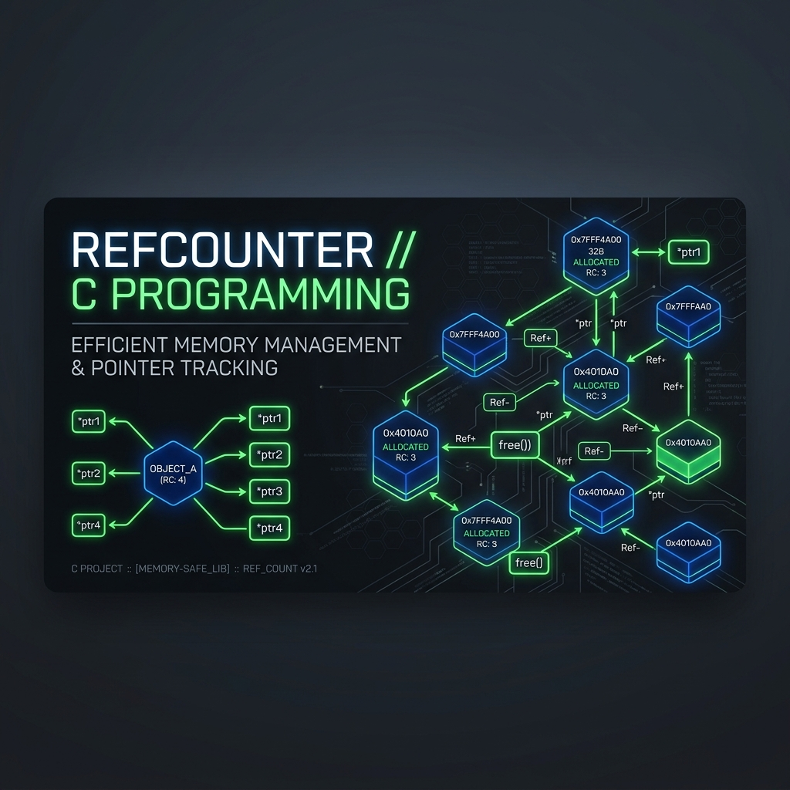

# Reference Counters in Absolute C



A minimalist, high-performance **Reference Counting** library and **Lisp-style S-Expression** evaluator implemented in pure C. This project demonstrates manual memory management techniques, pointer arithmetic for metadata tracking, and recursive data structures.

---

## 🚀 Features

- **Header-Only Reference Counting (`rc.h`)**:
  - Lightweight intrusive reference counting.
  - Custom destructor support for nested resource cleanup.
  - Metadata tracking using pointer offsets (no wrapper structs required for the user).
  - Built-in logging for allocation, acquisition, and release tracking.

- **S-Expression System**:
  - Support for core Lisp types: `NIL`, `SYMBOL`, `INTEGER`, `FLOAT`, and `PAIR`.
  - Recursive evaluator with symbolic function lookup.
  - Tail-recursive-ready list construction.

- **Robust Build System**:
  - Uses the `nob` build pattern for a seamless, dependency-free build experience.
  - Integrated **Valgrind** memory leak detection in the development workflow.

---

## 🛠️ Architecture

### Memory Management Pattern
The library uses a "Metadata-Prefix" pattern. When you allocate memory via `rc_alloc`, it allocates extra space for an `Rc` struct *before* the actual data pointer:

```c
// [ Rc Struct ] [ User Data ]
//               ^ Returned Pointer
```

This allows the user to treat the returned pointer as a regular pointer to their data, while the library can "reach back" to manage the reference count.

### Expression Types
Expressions are defined as a tagged union, allowing for flexible tree structures:
- **Cons Cells (Pairs)**: The backbone of the list system.
- **Atoms**: Symbols and primitive values.

---

## 🔨 Getting Started

### Prerequisites
- `clang` or `gcc`
- `valgrind` (for memory testing)
- standard `make` or just a C compiler

### Building and Running
The project uses the `nob` build system.

1. **Bootstrap the build system**:
   ```bash
   cc nob.c -o nob
   ```

2. **Run the build and tests**:
   ```bash
   ./nob
   ```
   This will compile `main.c`, link it with the necessary headers, and run it under Valgrind to ensure zero memory leaks.

---

## 📝 Example Usage

### Reference Counting API
```c
#define RC_IMPLEMENTATION
#include "rc.h"

void custom_destroy(void *data) {
    // Cleanup nested resources
}

// Allocate a reference-counted integer
int *my_int = rc_alloc(int, custom_destroy);
*my_int = 42;

// Share ownership
re_acquire(my_int);

// Release ownership (will free if count reaches 0)
rc_release(my_int);
```

### Expression Evaluation
```c
Expr *funcall = make_pair(
    make_symbol("swap"), 
    make_list(make_integer(1), make_integer(2))
);

Expr *result = eval(funcall);
dump_expr(result); // Outputs: (2 1)
```

---

## 🧪 Current Status
- [x] Basic Reference Counting
- [x] S-Expression Data Model
- [x] Symbolic `eval` (swap, +)
- []  Fix make_list_impl Loop Bug To Replace It with Recursive Ver Due To StackOverflow

---

## 📜 License
This project is open-source. Feel free to use and modify for educational purposes.
The Idea Come From TSDOING And Want
---
